# Cloud Environment Setup

This document describes how to build the NAOS cloud-side environment, including an AWS Lightsail instance, S3 bucket, APK repository, and HawkBit OTA server.

---

## 1. AWS Lightsail and Bucket

### 1.1 Create a Lightsail Instance

1. Open the AWS Lightsail console:
   [https://lightsail.aws.amazon.com/ls/webapp/home/instances](https://lightsail.aws.amazon.com/ls/webapp/home/instances)
2. Create an instance with a suitable size:

   - **Instance type**: Ubuntu 24.04
   - **Instance size**: choose based on your workload, with at least 2 GB RAM recommended

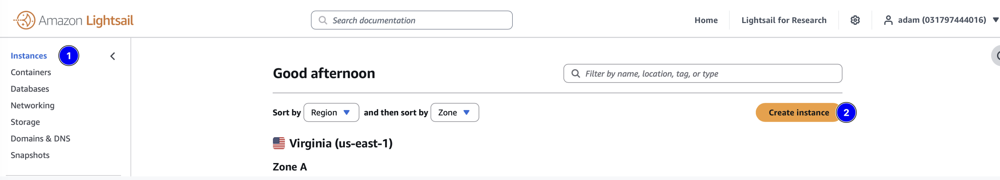

3. Open the required network ports on the instance:

   - HTTP (80)
   - HTTPS (443)
   - custom ports such as 8080 for webhooks

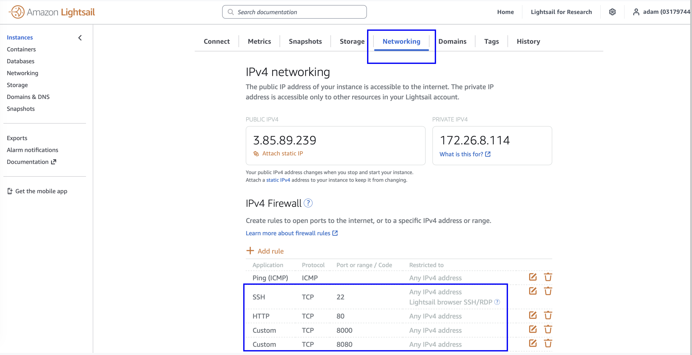

### 1.2 Create an S3 Bucket

1. Create an S3 bucket for file storage:

   - **Bucket name**: for example `naos-update-bucket`
   - **Region**: use the same region as the Lightsail instance

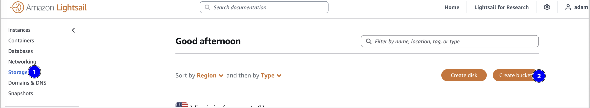

2. Attach the bucket to the Lightsail instance from the bucket management page.

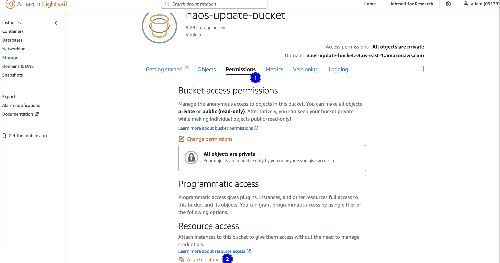

3. Create an access key for mounting and file upload. Keep the following values:

   - Access Key ID
   - Secret Access Key

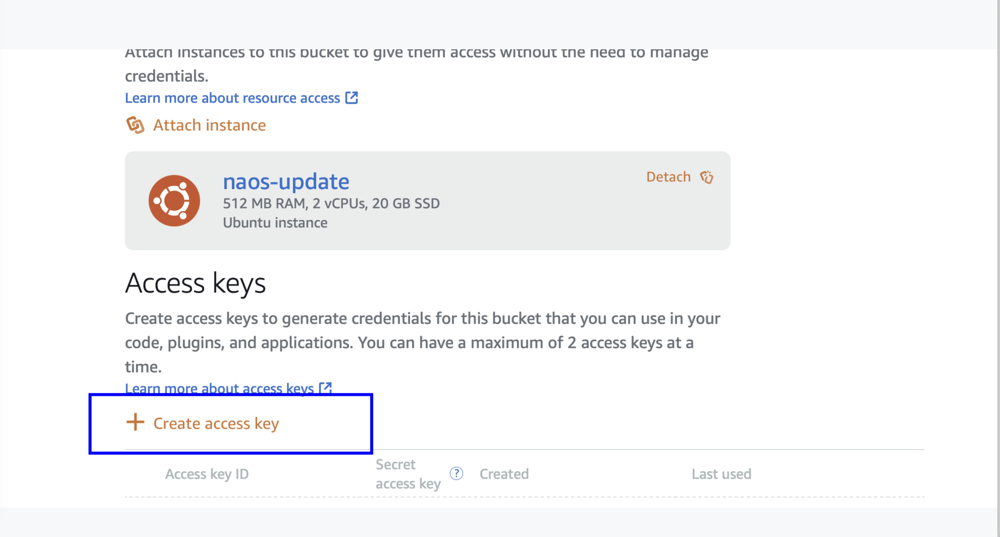

### 1.3 Mount the Bucket on the Instance

**Step 1: log in to the instance**

```bash
ssh ubuntu@<instance-ip>
```

**Step 2: install s3fs**

```bash
sudo apt update
sudo apt install s3fs
```

**Step 3: configure credentials**

Create `/home/ubuntu/.passwd-s3fs`:

```bash
cd /home/ubuntu
nano .passwd-s3fs
```

Format:

```text
Access key ID:Secret access key
```

Example:

```text
YOUR_ACCESS_KEY_ID:YOUR_SECRET_ACCESS_KEY
```

Set permissions:

```bash
chmod 600 .passwd-s3fs
```

**Step 4: create a mount point and mount the bucket**

```bash
mkdir /home/ubuntu/bucket

sudo s3fs naos-update-bucket /home/ubuntu/bucket \
    -o passwd_file=/home/ubuntu/.passwd-s3fs
```

**Step 5: auto-mount on boot (optional)**

Edit `/etc/fstab`:

```bash
sudo nano /etc/fstab
```

Add:

```text
s3fs#naos-update-bucket /home/ubuntu/bucket fuse _netdev,allow_other,passwd_file=/home/ubuntu/.passwd-s3fs 0 0
```

**Verify the mount**:

```bash
df -h | grep bucket
echo "test" > /home/ubuntu/bucket/test.txt
ls /home/ubuntu/bucket/
```

---

## 2. APK Repository

### 2.1 Overview

The APK repository stores versioned system component packages such as U-Boot, kernel, and rootfs for use by the image generator.

**Repository files**: `misc-tools/alpine-repo/`

**Key note**:

- the default APK signing keys are in `misc-tools/alpine-repo/.abuild/`
- you can replace them with your own keys

### 2.2 Deploy the APK Repository

**Option 1: use the prebuilt container**

```bash
docker pull ghcr.io/mixtile-rockchip/alpine-repo:latest
docker run --name alpine-repo \
    -p 80:80 \
    -v /home/ubuntu/bucket/alpine-repo:/data/alpine \
    -d ghcr.io/mixtile-rockchip/alpine-repo:latest
```

**Option 2: build locally**

```bash
docker build -t alpine-repo misc-tools/alpine-repo/
docker run --name alpine-repo \
    -p 80:80 \
    -v /home/ubuntu/bucket/alpine-repo:/data/alpine \
    -d alpine-repo
```

### 2.3 Create Repository Directories

```bash
mkdir -p /home/ubuntu/bucket/alpine-repo/x86_64
mkdir -p /home/ubuntu/bucket/alpine-repo/aarch64
```

Notes:

- `x86_64`: stores packages used during image generation such as U-Boot and kernel APKs
- `aarch64`: stores ARM packages if needed

### 2.4 Verify the Repository

```bash
curl http://localhost/alpine/x86_64/
curl http://<instance-ip>/alpine/x86_64/
```

---

## 3. HawkBit Server

### 3.1 Overview

HawkBit is the OTA management server used to distribute software updates.

### 3.2 Deploy HawkBit

**Option 1: use the prebuilt container**

```bash
docker pull ghcr.io/mixtile-rockchip/hawkbit-update-server:latest
```

**Option 2: build locally**

```bash
docker build -t hawkbit-update-server:latest misc-tools/hawkbit/
```

### 3.3 Configure and Start

**Step 1: update `docker-compose.yml`**

Edit `misc-tools/hawkbit/docker-compose.yml` and set the image:

```yaml
server:
  hawkbit:
    image: hawkbit-update-server:latest  # or ghcr.io/mixtile-rockchip/hawkbit-update-server:latest
```

**Step 2: start the service**

```bash
docker-compose -f misc-tools/hawkbit/docker-compose.yml up -d
```

**Step 3: verify access**

- URL: `http://<instance-ip>:8000`
- username: `admin`
- password: `naos`

---

## 4. Push OTA Packages Through HawkBit

### 4.1 Enable Security Token Verification

1. Log in to HawkBit with `admin / naos`.
2. Enable Security Token verification on the configuration page.

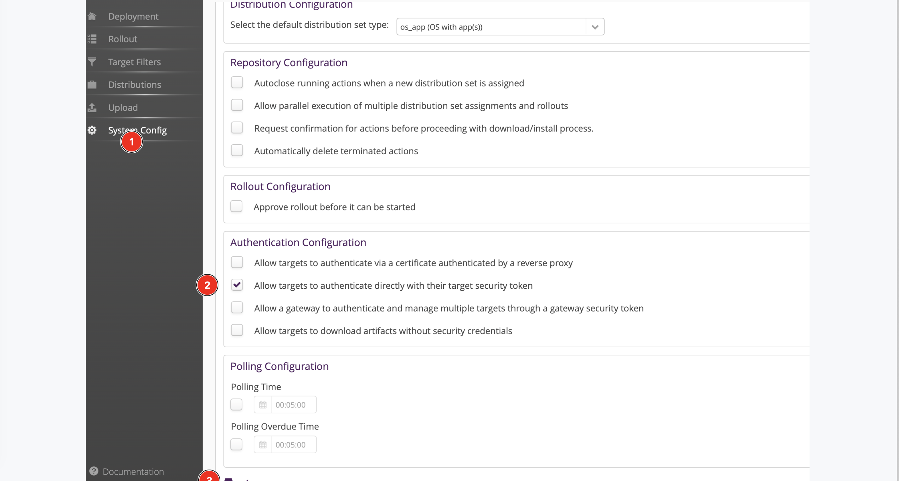

### 4.2 Create a Target

1. Open the **Deployment** page.
2. Click **Create Target**.

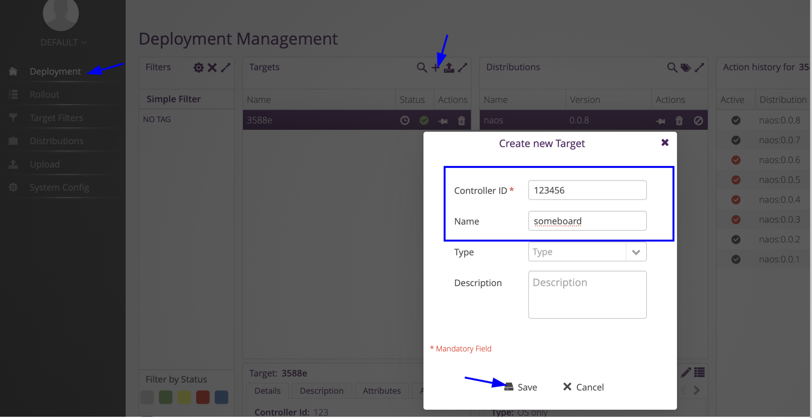

Important fields:

- **Controller ID**: unique identifier of the device
- **Security Token**: security token used for device authentication

3. Save the target information.
4. Configure the client:

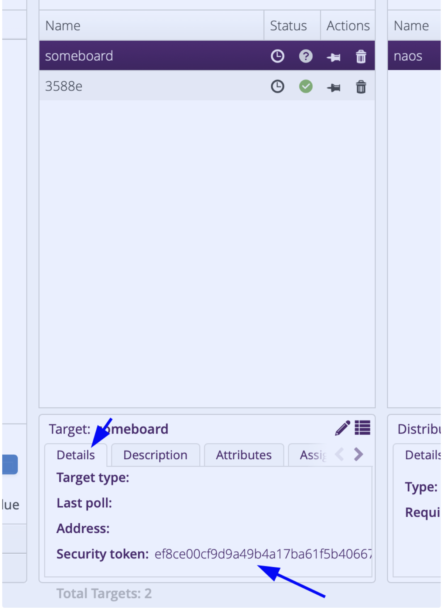

Edit `packages/alpine/etc/update-config.conf`:

```config
controller_id=<Controller ID>
security_token=<Security Token>
```

Devices using the same configuration will connect to this target and can receive the same rollout.

### 4.3 Upload a Software Module

1. Open the **Upload** page.
2. Create a new software module.

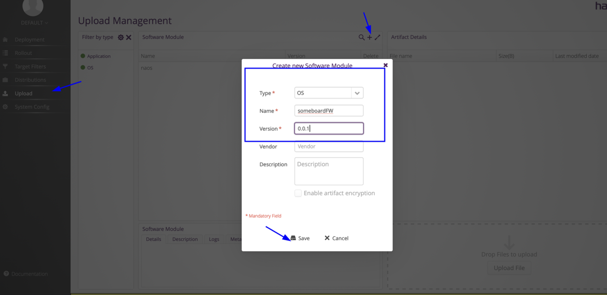

3. Upload an OTA package such as `update.img`.

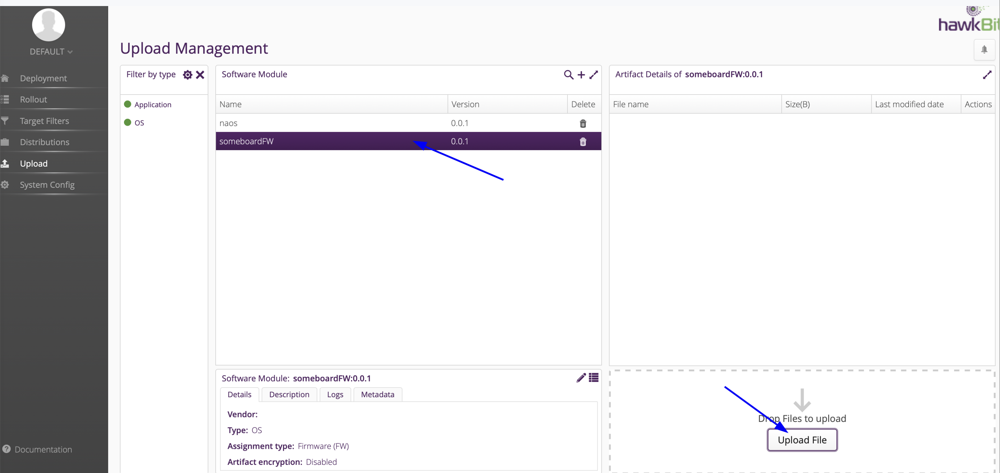

### 4.4 Create a Distribution

1. Open the **Distributions** page.
2. Create a new distribution.

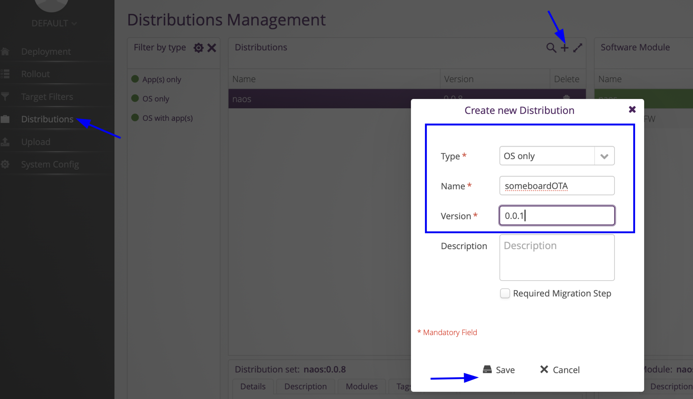

3. Drag the required software module, for example `someboardFW`, into the distribution, for example `someboardOTA`.
4. Confirm the assignment:

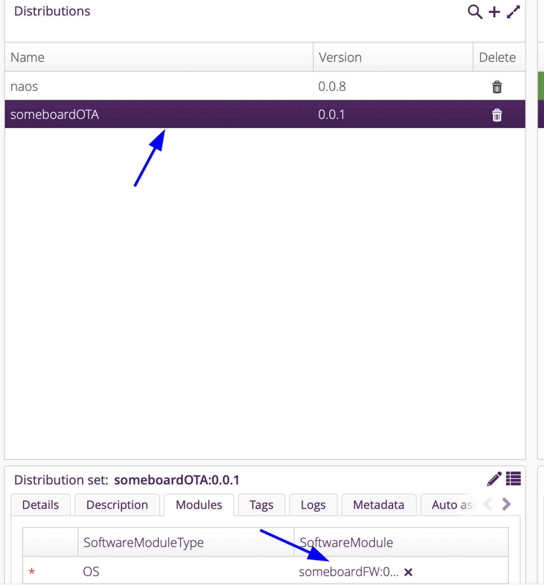

### 4.5 Create a Target Filter

1. Open the **Target Filter** page.
2. Create a new target filter.
3. Configure filter rules such as:

- Controller ID
- tags
- other target attributes

4. Save the filter.

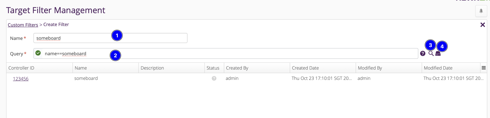

### 4.6 Publish a Rollout

1. Open the **Rollout** page.
2. Create a new rollout.
3. Choose:

- a distribution such as `someboardOTA`
- a target filter created earlier

4. Publish the rollout.

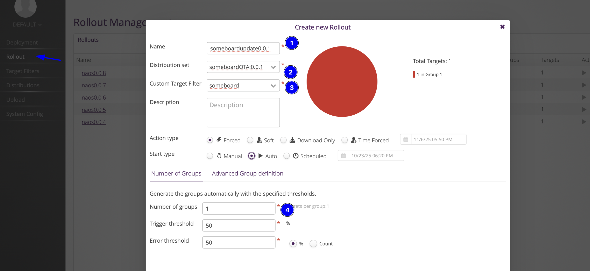

### 4.7 Monitor Upgrade Status

The Rollout page shows:

- upgrade progress
- success and failure counts
- detailed upgrade logs

---

## 5. Validation

### 5.1 Verify the APK Repository

```bash
curl http://<instance-ip>/alpine/x86_64/
curl -O http://<instance-ip>/alpine/x86_64/core3588e-uboot-1.0.0-r0.apk
```

### 5.2 Verify HawkBit

```bash
curl http://<instance-ip>:8000/DEFAULT/controller/v1/
```

Then open `http://<instance-ip>:8000` in a browser.

### 5.3 Verify Device Connectivity

1. Make sure `update-config.conf` is correct on the device.
2. Boot the device and let it connect to the HawkBit server.
3. Confirm the device appears on the Deployment page.

---

## 6. Troubleshooting

### 6.1 Bucket Mount Failure

**Problem**: `s3fs` mount fails.

**Checks**:

- verify the `.passwd-s3fs` format
- verify the access key ID and secret access key
- verify the bucket name
- verify instance permission to access the bucket

### 6.2 APK Repository Not Reachable

**Problem**: external access to the APK repository fails.

**Checks**:

- verify Lightsail ports are open
- verify the container is running with `docker ps`
- inspect logs with `docker logs alpine-repo`
- verify permissions on the mounted bucket directory

### 6.3 HawkBit Device Connection Failure

**Problem**: the device cannot connect to HawkBit.

**Checks**:

- verify `update-config.conf`
- verify Controller ID and Security Token
- verify network connectivity and firewall rules
- inspect HawkBit container logs

### 6.4 OTA Upgrade Failure

**Problem**: OTA upgrade fails on the device.

**Checks**:

- verify the upgrade package format
- verify free storage space on the device
- inspect device-side logs
- verify the HawkBit rollout configuration
